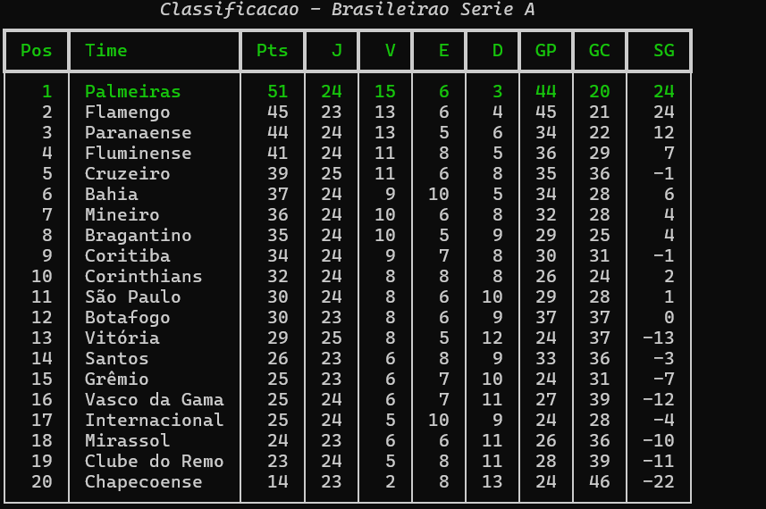

# Verdão Ops 🐷⚽

Central de dados do Palmeiras na linha de comando: próximos jogos, últimos resultados e classificação do Brasileirão num comando só — com relatório em HTML e cache local para funcionar mesmo quando a API está fora do ar.



## Como rodar (PowerShell)

```powershell
# 1. Clonar e entrar no projeto
git clone <url-do-repo>
cd verdao-ops

# 2. Criar e ativar o ambiente virtual
python -m venv .venv
.\.venv\Scripts\Activate.ps1

# 3. Instalar as dependências
pip install -r requirements.txt

# 4. Criar o .env com a sua chave (veja abaixo como obter)
Copy-Item .env.exemplo .env
# edite o .env e cole sua chave após o "="

# 5. Usar
python src\main.py --proximos     # próximos jogos
python src\main.py --resultados   # últimos resultados
python src\main.py --tabela       # classificação (Palmeiras destacado)
python src\main.py --relatorio    # gera relatorio.html na raiz do projeto
```

### Como obter a chave de API

1. Cadastre-se gratuitamente em [football-data.org](https://www.football-data.org/client/register) (sem cartão).
2. A chave (token) chega por e-mail / aparece no painel.
3. Cole no arquivo `.env`: `FOOTBALL_DATA_TOKEN=sua_chave_aqui`.

O plano gratuito inclui o Brasileirão Série A e limita a **10 chamadas por minuto** — por isso o cache local (abaixo).

### Configuração

As preferências ficam no `config.yaml`, fora do código:

```yaml
time_id: 1769 # ID do Palmeiras na API
competicao: BSA # Brasileirão Série A
proximos_jogos: 5 # quantos jogos futuros mostrar
ultimos_jogos: 5 # quantos resultados passados mostrar
cache_minutos: 60 # validade do cache
fuso: America/Sao_Paulo # horários exibidos em Brasília
```

Trocar de time ou competição é editar uma linha — nenhum código precisa mudar.

## Decisões técnicas

### 1. Segredo fora do código, configuração fora do código

A chave da API vive no `.env` (ignorado pelo Git) e as preferências no `config.yaml`. O código não contém nem segredo nem valor fixo de negócio: trocar o time acompanhado ou a competição é editar configuração, não programa. O repositório inclui um `.env.exemplo` mostrando o formato, sem a chave.

### 2. Falha visível, nunca silenciosa

Toda resposta da API é validada antes de usar: erro de rede, autenticação ou HTTP vira mensagem clara na tela e registro em log (`logs/verdao_ops.log`). Quando o dado exibido vem do cache, o programa **avisa a idade dele** — e quando a API falha e o cache está desatualizado, o aviso diz isso explicitamente. O usuário nunca recebe informação velha achando que é atual.

### 3. Camadas separadas + logging

`api_client` (rede), `cache` (persistência e validade), `modelos` (dados), `relatorio` (saída rich/HTML) e `main` (CLI) são módulos independentes. O cache não conhece a API: recebe uma função de busca qualquer — o que permitiu testar toda a lógica de cache **sem internet nenhuma**. A camada de exibição não sabe se o dado veio da rede ou do disco.

## Resiliência (cache)

- Cache válido → usa o cache e avisa a idade (economiza o limite da API).
- Cache expirado + API ok → busca dado novo e atualiza o cache.
- Cache expirado + API fora → mostra o cache antigo **com aviso claro** de desatualização.
- Sem cache + API fora → mensagem de erro clara, sem travar.

## Processo (transparência sobre IA)

> Código inicial gerado com IA (Claude Code), depois reescrito à mão e revisado bloco a bloco até eu conseguir explicar cada parte sem consultar. As decisões de design foram minhas.

## Melhorias futuras

- Alerta automático antes das partidas (Agendador de Tarefas do Windows chamando o script).
- Histórico de desempenho em gráfico.
- Suporte a outras competições (Libertadores, Copa do Brasil) no mesmo relatório.

## Licença

[MIT](LICENSE)
